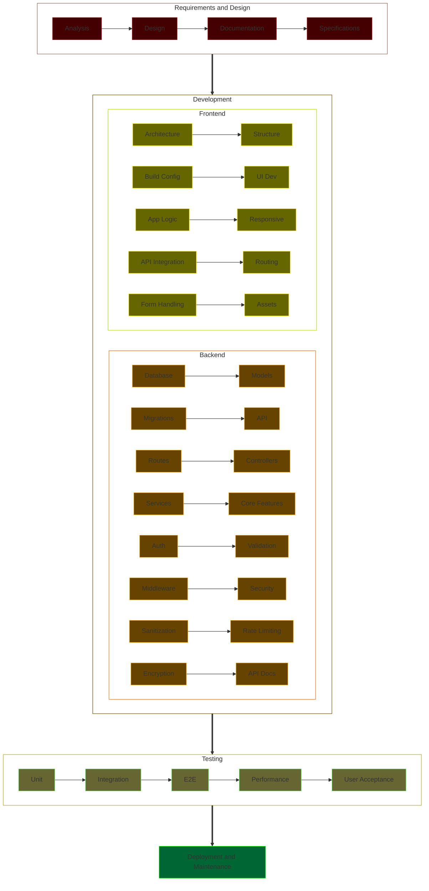

# Full-Stack-Webdevelopment-flowchart

Web development workflow

```mermaid
flowchart TD
    subgraph A[Requirements and Design]
        direction LR
        A1[Analysis]-->A2[Design]
        A2-->A3[Documentation]
        A3-->A4[Specifications]
    end

    subgraph X[Development]
        subgraph B[Backend]
            direction LR
            B1[Database]-->B2[Models]
            B3[Migrations]-->B4[API]
            B5[Routes]-->B6[Controllers]
            B7[Services]-->B8[Core Features]
            B9[Auth]-->B10[Validation]
            B11[Middleware]-->B12[Security]
            B13[Sanitization]-->B14[Rate Limiting]
            B15[Encryption]-->B16[API Docs]
        end
        subgraph C[Frontend]
            direction LR
            C1[Architecture]-->C2[Structure]
            C3[Build Config]-->C4[UI Dev]
            C5[App Logic]-->C6[Responsive]
            C7[API Integration]-->C8[Routing]
            C9[Form Handling]-->C10[Assets]
        end
    end

    subgraph D[Testing]
        direction LR
        D1[Unit]-->D2[Integration]
        D2-->D3[E2E]
        D3-->D4[Performance]
        D4-->D5[User Acceptance]
    end

    A===>X===>D===>E[Deployment and Maintenance]

    classDef groupA stroke:#a00,fill:#400
    classDef groupB stroke:#fa0,fill:#640
    classDef groupC stroke:#fe0,fill:#660
    classDef groupD stroke:#6f6,fill:#663
    classDef groupE stroke:#0f0
    classDef subgraphA stroke:#955,fill:none
    classDef subgraphX stroke:#640,fill:none
    classDef subgraphB stroke:#f60,fill:none
    classDef subgraphC stroke:#ad0,fill:none
    classDef subgraphD stroke:#aa0,fill:none
    classDef subgraphE stroke:#0f0,fill:#063
    class A1,A2,A3,A4 groupA
    class B1,B2,B3,B4,B5,B6,B7,B8,B9,B10,B11,B12,B13,B14,B15,B16 groupB
    class C1,C2,C3,C4,C5,C6,C7,C8,C9,C10 groupC
    class D1,D2,D3,D4,D5 groupD
    class A subgraphA
    class B subgraphB
    class C subgraphC
    class D subgraphD
    class E subgraphE
    class X subgraphX

```
